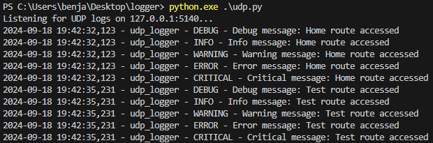

# Простой логер на примере Flask

Запуск
- python main.py (создает локальный сервер)
- python udp.py (читает логи с сервера)

## Примерно так

В примере только считывается переход на страницы и выводятся все уровни логов